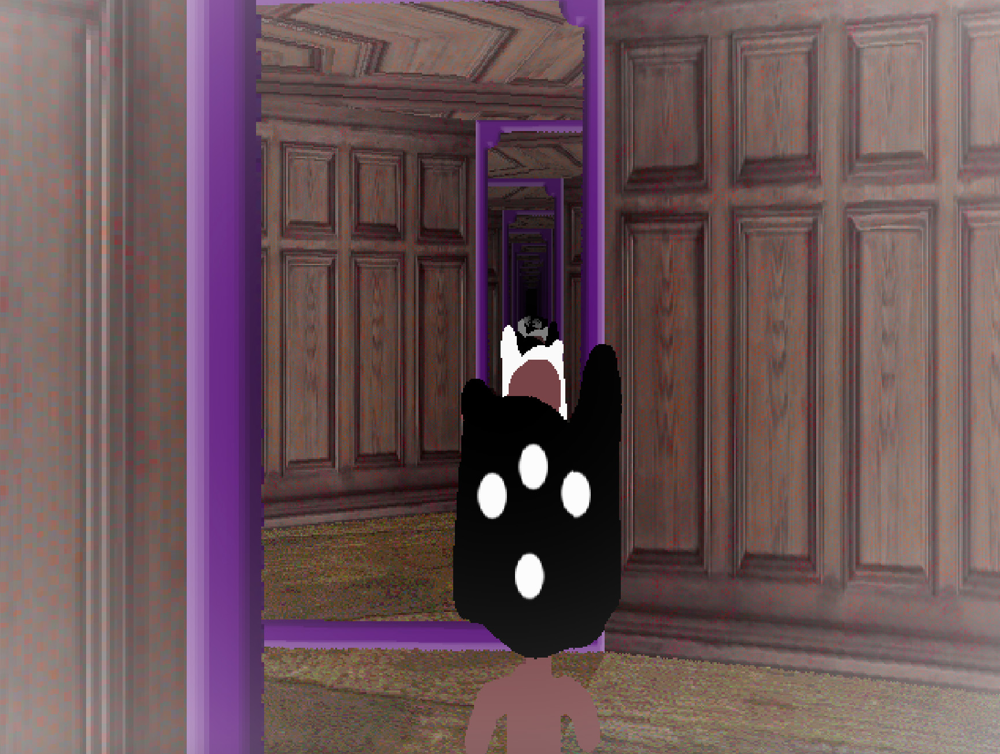
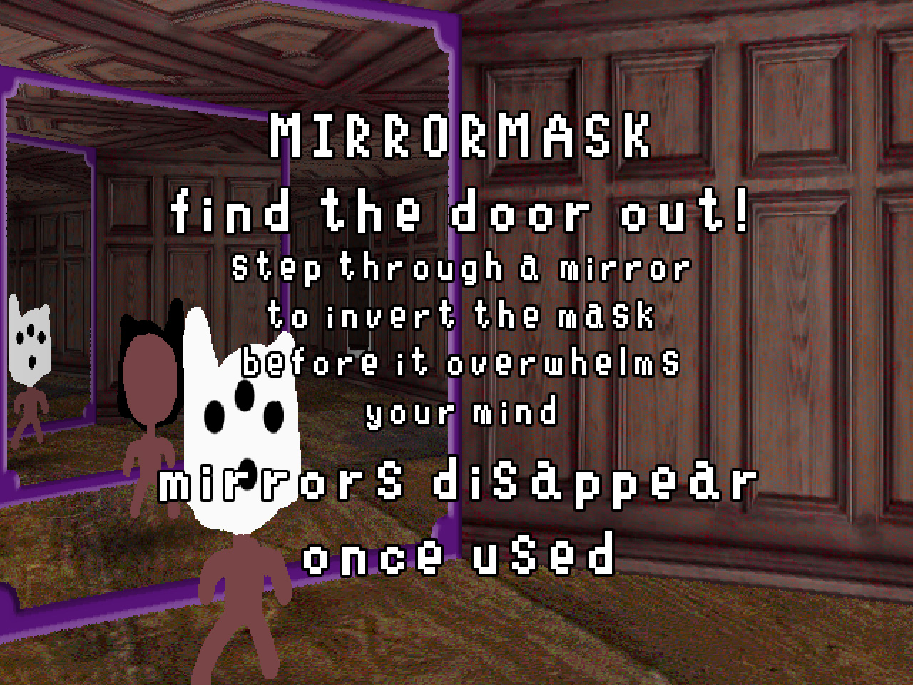

# MirrorMask

**[Play the game](https://hdemmer.github.io/ggj26-doom/)**

I wanted to write a DOOM-like raycast engine that supports infinite mirroring.

You have to find the exit door. The mask slowly overwhelms you, but step through the mirror to invert its effect.

Once you step through a mirror, it disappears.

## Play

**[Play the game](https://hdemmer.github.io/ggj26-doom/)**

## Screenshots

